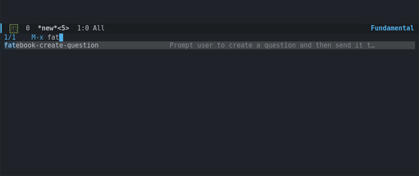

# fatebook.el

fatebook.el is an Emacs plugin to create questions on Fatebook. Usage:



## Installation 
### Dependencies

Fatebook requires the `request` package. If you don't have it already installed, install it through the instructions found [here](https://github.com/tkf/emacs-request).

### Installing fatebook.el

- With `use-package` and `straight.el`:
``` emacs-lisp
(use-package fatebook
  :straight (fatebook :repo "sonofhypnos/fatebook.el" :host github
                      :files ("fatebook.el"))
  :commands fatebook-create-question)
```

- Manual installation: copy `fatebook.el` to your load-path and then run `(require 'fatebook)`. For example:

1. Clone the repository:

```bash
git clone https://github.com/sonofhypnos/fatebook.el.git
```

2. Add the directory to your `load-path`. In your `.emacs` or `init.el`, add:

```elisp
(add-to-list 'load-path "/path/to/fatebook.el")
```

Replace `"/path/to/fatebook.el"` with the actual path to the directory.

3. Load the package:

```elisp
(require 'fatebook)
`

[Doom Emacs](https://github.com/hlissner/doom-emacs):

Put this into packages.el
``` emacs-lisp
(package! fatebook
  :recipe (:host github
           :repo "sonofhypnos/fatebook.el"))
```

## Storing your api-keys


### TLDR: 
open `~/.authinfo.gpg` with emacs:

``` sh
emacs ~/.authinfo.gpg
```

Emacs will prompt you for a password to encrypt the file (you can also use `~/.authinfo` if you don't want to encrypt your secrets (not recommended!)).

Add this line to the file:

``` sh
machine fatebook.io login defaultUser password $your-api-key
```

Replace $your-api-key with your api key found under https://fatebook.io/api-setup and leave the remaining fields the same.

### Long version


For the longer explanation see this section I stole from [(ghub)Getting Started](https://magit.vc/manual/ghub/Storing-a-Token.html):

> Please also see [(auth)Top](https://www.gnu.org/software/emacs/manual/html_node/auth/index.html#Top) for all the gory details about Auth-Source.

> The variable auth-sources controls how and where Auth-Source keeps its secrets. The default value is a list of three files: ("~/.authinfo" "~/.authinfo.gpg" "~/.netrc"), but to avoid confusion you should make sure that only one of these files exists and then you should also adjust the value of the variable to only ever use that file, for example:

> (setq auth-sources '("~/.authinfo"))

> In ~/.authinfo secrets are stored in plain text. If you don’t want that, then you should use the encrypted ~/.authinfo.gpg instead:

> (setq auth-sources '("~/.authinfo.gpg"))

> Auth-Source also supports storing secrets in various external key-chains. See [(auth)Top](https://www.gnu.org/software/emacs/manual/html_node/auth/index.html#Top) for more information. 

> The default Auth-Source backends only support storing three values per entry; the "machine", the "login" and the "password".

If you want fatebook.el to be able to find your api key use `fatebook.io` for machine and `defaultUser` for user.

## Configuration

By default, fatebook.el uses `org-read-date` to pick a date. If you don't want to load the whole of org for this package, set `fatebook-use-org-read-date` to nil in your config or in the customization interface.

## Reporting Bugs

If you are having problems make sure you have followed all the steps listed above. If you still have problems run `fatebook-create-question` with `fatebook-debug` set to `t` and include the debug message from the `echo-area` in your bug report.

